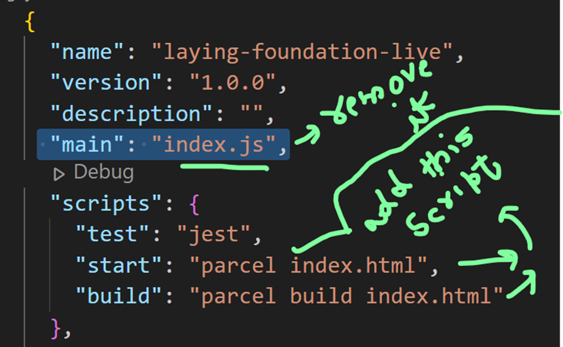
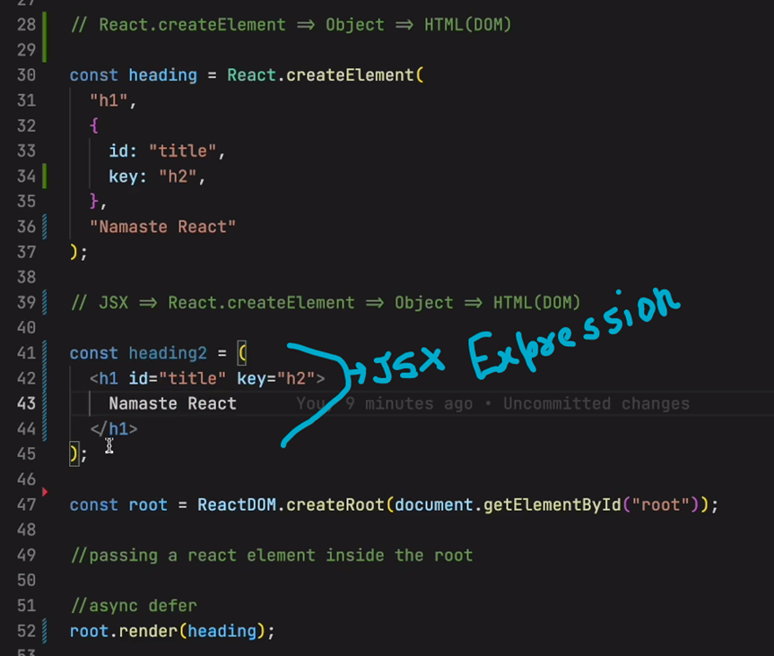

///////////////////////
laying foundation:
// React.createElement=>Object=> html(DOM)

>Dependencies type:  Normal Dependencies, Dev dependencies, Global dependencies.
>Render: updating something in DOM
>when there is multiple siblings/more than one child inside a parent  element, need to mention a unique “key” to them, otherwise u would get an error.
>Polyfill-> code replacement for newer/old version of code,
e.g, if there is some old browser who doesn't understand ES6 features then, Polyfill will replace that part of code compatible to older browser with help of babel(It perform polyfill automatically).
>ES6 newer version of javascript.

// for making it short we have to add some script on package.json.

Npx parcel index.html=>it means npx execute npm package parcel index.html.
if you don’t want write this whole line, we can just write some script in  package.json to ease or work
>npx parcel index.html == npm run start == npm start
>npx parcel build index.html == npm run build 

 

// need to install this plugin to remove console statement 
link:    https://www.npmjs.com/package/babel-plugin-transform-remove-console
> npm i babel-plugin-transform-remove-console
//create “.babelrc” page and add 

{"plugins": [ ["transform-remove-console", { "exclude": [ "error", "warn"] }] ]}

React->it came with this philosophy that update whole HTML using javascript  in better way, but it lead to less manageable and less readability of code. And to overcome it issue JSX comes .
React keep tracks of keys.

//JSX :

JSX: JavaScript syntax which is use to create React element ,HTML like syntax, (but not HTML tag).
>Jsx empower react, it makes code more readable , manageable but behind the scene JSX use React.createElement .
>naming convention : camel case(JavaScript use it)
>JSX,REACT,HTML both are different
>Advantage:syntactical sugar, Readability, less code, developer efficiency, maintainability.
>{}-> we can write any piece of javascript code within {} brackets.

 

//Babel:
->It's a compiler of JavaScript
->Babel come along with parcel
->Babel execute JSX or transpile the jsx code into React.createElement
->It understand JSX can convert into normal React and later react return an object and when that object render over DOM ,the code first get transpiled by parcel using babel and then  that converted/transpiled code(i.e React.createElement) push to JS engine and .->It create AST tree 

so,
BABEL convert=>JSX=>React.createElement => object => HTML(DOM)

Extra:
*IMP:
1> Proj. has two packg.-lock.jscon,
->one for project itself.
->second in node_module(for transitive dependencies)

2>Pack.json has multiple files, each for every packages.

//React component :
two type of components:
1>class based component
2>functional component

 

>Everything is Component in React.

1>Functional component: It’s a normal javascript function, which  return some JSx code/React Element is a functional component.
>Functional component or any component name starts with capital letter, not mandatory but it’s a good practice.

//we can add functional component inside react element and vice-versa

//javascript JSX is very secure, it it escape from xss attack.
>if someone want to inject any malicious code  as we know we can run any piece of code inside {} brackets which might come from api data or anywhere, jsx first does sanitization of the piece of code, to protect the app.

//component Composition or composing component :
component within a component.
Questions & Answers:

// the jsx code transpiled before it reach  to js engine
//React build to improve developer work easier.
//Everything behind is just a vanilla js.
//Q,  Transpiler?
// Q,  babel alternative?
// Browser or js engine doesn’t know JSX, babel or parcel or any bundler, it only understand vanilla/plain JS or Ecmascriptor ES6or ES5 etc…..
//Js engine different than Babel.

//Q when we have React element than why there is need of React functional component.?

//without Babel JSx won’t work, it come along with parcel,webpack ,vite etc., or we can directly install it from npm.
//Q, React concillation.

//////////////////////////////////////////////////////////////

Igniting the app:

Igniting the app:
React cannot build a production ready app. So they need some other dependencies to build the same, i.e parcer nd etc..

Package-lock.json: plj. is very imp file, it lock the version, never , never  put it into .gitignore, 

>npm I react
>npm I react-dom

// To execute/run the  project we use npx:
npx=> It execute     using entry point/file(e.g, index.html)
 of the project nd create a dev build app .

>npx parcel index.html

Parcel:
>npm i -D parcel (to install parcel with devdependencies)
=>parcel will give a running server.
HMR =>Hot Module Replacement, work as a live server(operated by parcel ).
=>file watcher algorithm(written in c++)=>it keep track changes in any file nd later HMR keep updating .
=>Bundling
=>Minify
=>Cleaning our code(e.g, deleting console statement)
=>dist folder =>it contain production build code.
=>dev & production build
=>super fast build algorithm 
=>Image optimization
=>caching while development
=>compression (rename variables )
=>compatible with older version of the browser
=>HTTPS on dev
=>manage port Number(if  multiple app is running)
=>Zero config(parcel need zero configuration)
=>consistent hashing algorithm(use for caching)
=>we should put “.parcel-chache”,”dist”,”node_modules” in “.gitignore.”
*Note=> Everything which is auto generated must be put into .gitignore file.

=>Transitive dependencies: dependencies who depend  over another dependencies(i.e, dependencies of trees).

